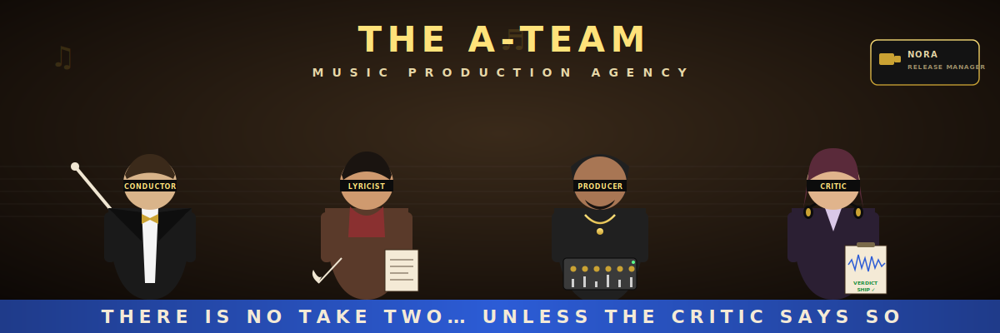

# A-Team Music Production Agency

A full-service AI music studio built as a squad of custom [GitHub Copilot agents](https://code.visualstudio.com/docs/copilot/customization/custom-agents).
Adapted from the [A-Team](https://github.com/sinedied/a-team) pattern for music production: research a theme, write lyrics, render with ACE-STEP 1.5, listen critically, iterate, ship.

> *"Give me a theme and I'll give you a record."* — Quincy, the Conductor

## What it does

You give the conductor a theme — for example *"a song cycle based on poems by
Edgar Allan Poe"* — and the squad will:

1. **Research & write** (`lyricist`) — Pull the source material together,
   draft lyrics, define the sonic palette (genre, tempo, key, mood,
   instrumentation).
2. **Produce** (`producer`) — Render audio by calling [ACE-STEP 1.5](https://github.com/ace-step/ACE-Step)
   running on a Gradio endpoint of your choice (local, LAN, or remote).
3. **Critique** (`critic`) — Analyze the rendered audio (tempo, key, energy,
   spectral characteristics, lyric adherence), compare against the brief,
   and emit refinement notes.
4. **Iterate** (`conductor`) — Decide whether to ship, re-render with tweaked
   parameters, or kick back to the lyricist for a re-brief. Cap: 5 iterations.

## The squad

| Agent | Codename | Role |
|-------|----------|------|
| **conductor** | Quincy | Leads the team, drives the produce → critique → refine loop, commits when shipped |
| **lyricist** | Cohen | Researches theme, writes lyrics, drafts the production brief |
| **producer** | Rubin | Calls ACE-STEP 1.5, manages prompt parameters, renders audio |
| **critic** | Pauline | Listens back, scores against brief, emits actionable refinements |

## Setup

### 1. Python tooling

The producer and critic call Python helpers under `tools/`. Install once:

```powershell
cd tools
python -m venv .venv
.\.venv\Scripts\Activate.ps1
pip install -r requirements.txt
```

### 2. ACE-STEP backend

Set the URL of your ACE-STEP Gradio instance via the `ACE_STEP_URL` environment
variable. The conductor will also ask for it the first time you start a song if
it isn't set:

```powershell
$env:ACE_STEP_URL = "http://your-host:7860/"
```

### 3. Use the conductor

In VS Code chat, pick the **conductor** agent (or @-mention it) and give it a
theme:

> Produce a 3-track EP based on poems by Edgar Allan Poe — gothic, orchestral,
> dramatic.

The conductor handles the rest, delegating to the lyricist, producer, and
critic in turn. Output appears under `songs/<slug>/`.

## Layout

```
.github/agents/        # The four custom agents (.agent.md)
.github/prompts/       # Reusable slash-command prompts
tools/                 # ACE-STEP client + audio analysis CLIs
songs/<slug>/          # Per-song artifacts: brief, iterations, final
memory/                # Shared decisions & conventions
specs/                 # Long-form production specs (optional)
AGENTS.md              # Project rules + shared memory contract
```

## License

MIT
